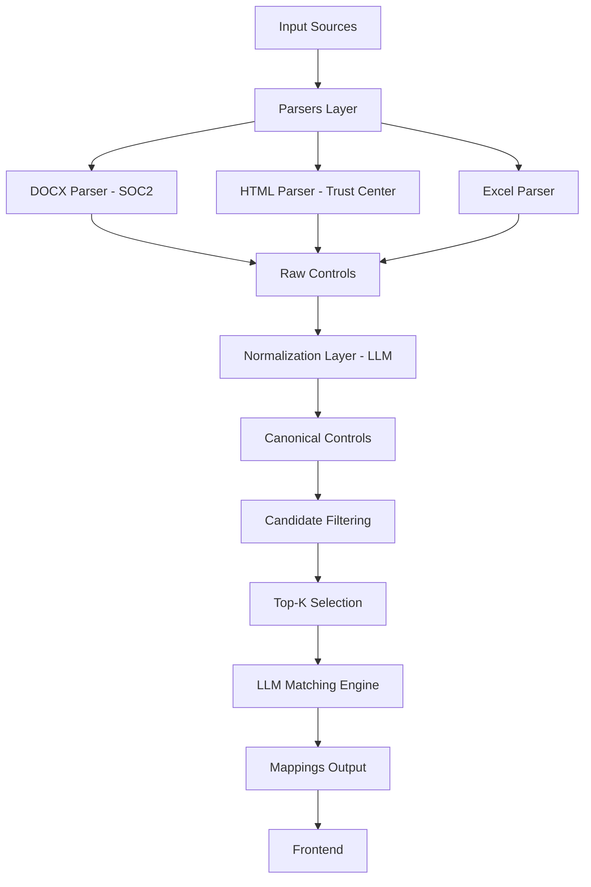

# Control Mapping System

## Overview

This project builds a system to ingest, normalize, and map security/compliance controls across multiple sources:

- SOC 2 Report (document)
- Trust Center (web URL)
- Common Control Master (Excel – normalized base)

The system extracts controls from each source, normalizes them into canonical form using LLMs, and maps them against a shared control library to identify overlap, partial coverage, and gaps.

---

## Key Problem

Different organizations describe the same control in different ways.

Example:

- “Admins must use MFA”
- “Privileged access requires multi-factor authentication”

These represent the same intent but differ in structure and wording.

The system solves this by:

- normalizing controls into canonical form
- applying lightweight candidate filtering
- using LLM reasoning for final semantic matching

---

## Features

- Extract controls from:
  - DOCX (SOC 2 report)
  - Web (Trust Center URL)
  - Excel (Common Control Master)

- Normalize controls using LLM:
  - convert raw statements into canonical security intents

- Hybrid mapping pipeline:
  - keyword-based filtering
  - lightweight scoring + ranking
  - LLM-based validation

- Supports:
  - 1:1 mappings
  - 1:many mappings (limited, confidence-based)
  - partial match detection

- Output classification:
  - FULL → complete intent match
  - PARTIAL → partial overlap in intent
  - NONE → no meaningful alignment

- Explainability via LLM-generated rationale

---

## Project Structure

```
backend/
  parsers/
  services/
frontend/
eval/
data/
.env
README.md
```

---

## Setup Instructions

### 1. Input Data

Create `data/` folder:

```
data/
  soc2.docx
  controls.xlsx
```

---

### 2. Environment Setup

```
OPENAI_API_KEY=your_api_key_here
```

---

### 3. Install Dependencies

```
npm init -y
npm install express cors mammoth xlsx cheerio axios openai dotenv
```

---

### 4. Run Backend

```
node backend/server.js
```

Server runs at:

```
http://localhost:3000
```

---

### 5. Open UI

```
frontend/index.html
```

Enter Trust Center URL → Click Analyze

---

## API Endpoint

### GET `/analyze?url=<trust_center_url>`

### Response Format

```json
{
  "source_controls": [
    {
      "control_id": "SC-1",
      "raw_text": "Roles and responsibilities are documented"
    }
  ],
  "normalized_common_controls": [
    {
      "control_id": "NCC-1",
      "text": "Defined security roles and responsibilities exist"
    }
  ],
  "mappings": [
    {
      "source_control_ids": ["SC-1"],
      "normalized_common_control_ids": ["NCC-1"],
      "match_type": "partial",
      "rationale": "Both define security accountability but differ in implementation depth"
    }
  ]
}
```

---

## Approach

### 1. Extraction Layer

- SOC2: DOCX parsing
- Trust Center: HTML scraping
- Excel: structured control ingestion

---

### 2. Normalization Layer (LLM)

Each extracted control is normalized into:

- atomic security intent
- vendor-neutral phrasing
- standardized terminology

---

### 3. Candidate Filtering Layer

- keyword-based filtering reduces search space
- lightweight scoring ranks candidates
- top-K selected per control

---

### 4. Mapping Logic (Hybrid)

- pre-filtering
- ranking
- LLM validation

---

## Architecture Diagram



---

## Tradeoffs

- Better accuracy vs higher latency
- LLM cost vs precision
- Heuristic filtering may miss edge cases

---

## Limitations

- small eval dataset
- no full graph-based many-to-many matching
- domain classification not implemented

---

## Future Improvements

- vector DB (FAISS / Pinecone)
- caching normalization layer
- graph-based mapping engine
- better evaluation dataset
- UI visualization improvements

---

## Summary

A practical compliance mapping system combining:

- structured extraction
- LLM normalization
- lightweight retrieval filtering
- LLM reasoning
